<!-- Edit this source; prepare.mjs refreshes API links and validates the live renderer data. -->

  <a href="https://prithvi8706.github.io/Prithvi8706/">
    <picture>
      <source media="(prefers-reduced-motion: reduce)" srcset="assets/mascot-v023/turbo-granny-still.png" />
      <source media="(prefers-color-scheme: dark)" srcset="assets/mascot-v023/turbo-granny-dark.gif" />
      <source media="(prefers-color-scheme: light)" srcset="assets/mascot-v023/turbo-granny-light.gif" />
      
    </picture>
  </a>

<picture><source media="(prefers-reduced-motion: reduce)" srcset=".github/assets/readme-aura-hero-static-60a0a4790f07.svg" /></picture>

<picture><source media="(prefers-reduced-motion: reduce)" srcset=".github/assets/readme-aura-stats-static-145692bc9d46.svg" /></picture>

<picture><source media="(prefers-reduced-motion: reduce)" srcset=".github/assets/readme-aura-languages-static-8e3dcfed0184.svg" /></picture>

<a href="https://github.com/collectioneur/readme-aura">powered by readme-aura</a>

