<!-- Edit this source; build-time GitHub evidence supplies the profile, stats and skills. -->

  <a href="https://prithvi8706.github.io/Prithvi8706/rooftop/">
    <picture>
      <source media="(prefers-reduced-motion: reduce)" srcset="assets/rooftop-v029/rooftop-still.png" />
      
    </picture>
  </a>

<a href="https://prithvi8706.github.io/Prithvi8706/rooftop/">Enter the rooftop</a>

<picture><source media="(prefers-reduced-motion: reduce)" srcset=".github/assets/readme-aura-hero-static-fdfa9beea556.svg" /></picture>

<picture><source media="(prefers-reduced-motion: reduce)" srcset=".github/assets/readme-aura-stats-static-21508f2cee76.svg" /></picture>

<picture><source media="(prefers-reduced-motion: reduce)" srcset=".github/assets/readme-aura-skills-static-5359f4897b62.svg" /></picture>

<a href="https://github.com/collectioneur/readme-aura">powered by readme-aura</a>

