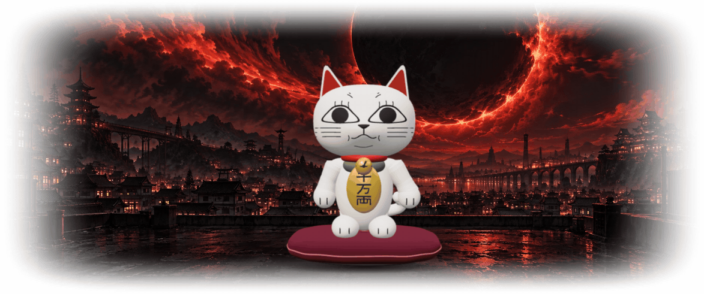

<!-- Edit this source; build-time GitHub evidence supplies the profile, stats and skills. -->

  <a href="https://prithvi8706.github.io/Prithvi8706/">
    <picture>
      <source media="(prefers-reduced-motion: reduce)" srcset="assets/mascot-v033/turbo-granny-still.png" />
      <source media="(prefers-color-scheme: dark)" srcset="assets/mascot-v033/turbo-granny-dark.gif" />
      <source media="(prefers-color-scheme: light)" srcset="assets/mascot-v033/turbo-granny-light.gif" />
      
    </picture>
  </a>

<picture><source media="(prefers-reduced-motion: reduce)" srcset=".github/assets/readme-aura-hero-static-cdaa3001bc68.svg" /></picture>

<picture><source media="(prefers-reduced-motion: reduce)" srcset=".github/assets/readme-aura-stats-static-129f10bec98f.svg" /></picture>

<picture><source media="(prefers-reduced-motion: reduce)" srcset=".github/assets/readme-aura-skills-static-8686fb83491f.svg" /></picture>

<a href="https://github.com/collectioneur/readme-aura">powered by readme-aura</a>

